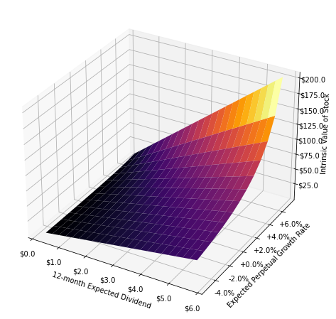

 (Jupyter Notebook)  

 (Jupyter Lab)

---
# Dividend Discount Model
### [AppleDaily20201005](#Dividend-Discount-Model)

#### HSBC (0005.HK) share price
 share price")

#### HSBC (0005.HK) rolling 12 months dividend 
 rolling 12 months dividend")

#### HSBC (0005.HK) dividend discount model valuation (1 stage)
 dividend discount model valuation (1 stage)")

#### HSBC (0005.HK) dividend discount model valuation (2 stages)
 dividend discount model valuation (2 stages)")

#### HSBC (0005.HK) DDM model multivariate surface plot
